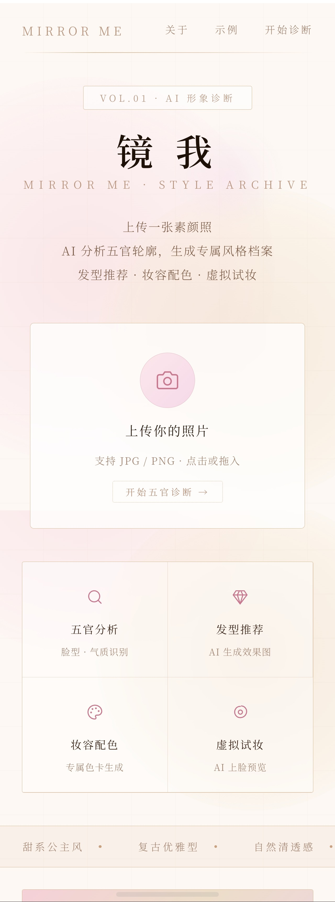
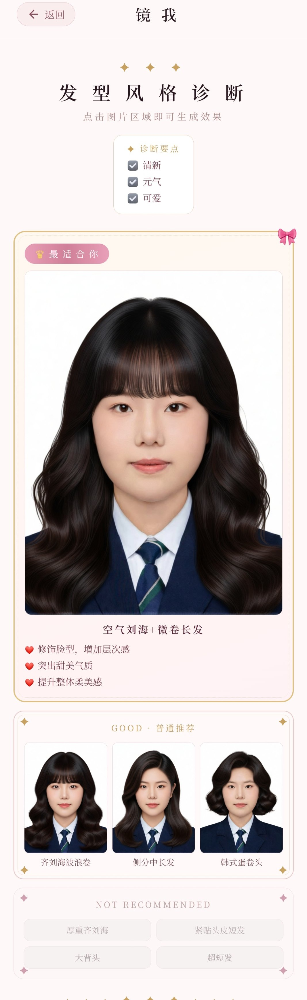
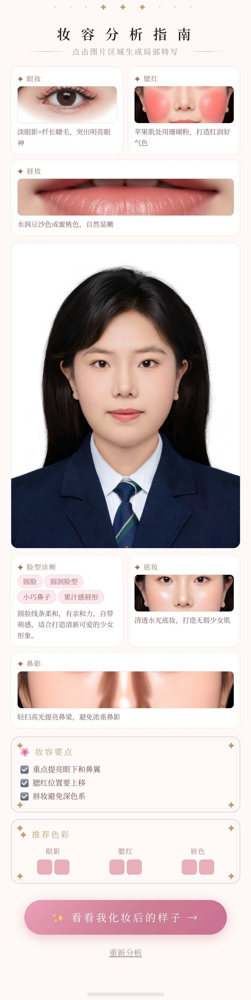
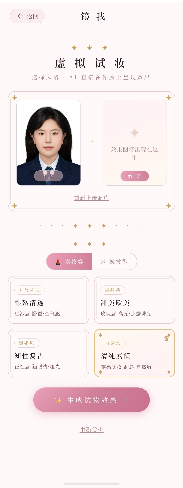
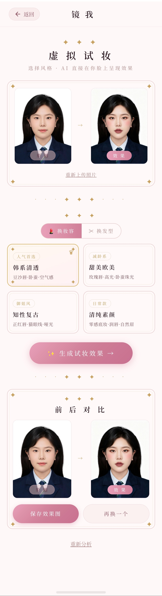
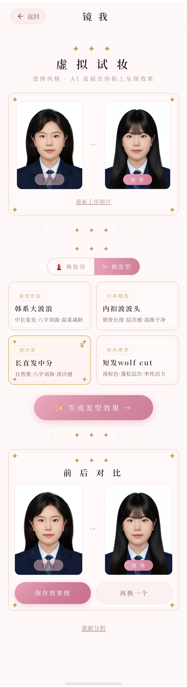

<div align="center">

# 镜 我 · Mirror Me

**AI 形象顾问 · 上传素颜照，获得专属风格档案**

[](https://mirror-me.1412608669.workers.dev)
[](https://nextjs.org)
[](https://workers.cloudflare.com)

</div>

---

## 产品简介

镜我是一款面向东亚女性的 AI 形象顾问工具。用户上传一张素颜照，AI 自动分析五官特征与气质类型，生成专属的日杂风格档案——包含发型推荐效果图、妆容配色指南，并支持虚拟换妆与换发型。

> 灵感来源：小红书上 GPT-4o 换妆内容大量传播，但国内用户使用门槛高（需翻墙、找 prompt）。镜我把这个能力做成开箱即用的工具，核心路径是：上传素颜照 → 获得专属五官分析报告 → 看到 AI 生成的上妆效果图。

---

## 核心功能

| 功能 | 描述 |
|------|------|
| 🔍 五官分析 | 调用 Qwen3-VL-32B 视觉模型，识别脸型、气质类型、面部特征 |
| 💇 发型推荐 | AI 生成真实感换发效果图，含「最适合你」+ GOOD 推荐 + NOT RECOMMENDED |
| 💄 妆容指南 | 眼妆 / 腮红 / 唇妆 / 底妆 / 鼻影五维分析，配专属色卡 |
| ✨ 虚拟试妆 | 支持 4 种妆容风格 + 4 种发型风格，AI 直接在脸上生成效果 |

---

## 产品截图

### 首页



### AI 分析加载中


### 发型风格诊断



### 妆容分析指南



### 虚拟试妆



### 换妆效果



### 换发型效果



---

## 用户路径

```
上传素颜照
    ↓
AI 分析五官特征（Qwen3-VL-32B）
    ↓
风格档案页（发型推荐 + 妆容配色 + 色卡）
    ↓
虚拟试妆页（AI 在脸上生成换妆/换发效果）
```

**两页分工：**
- **结果页** = 认知（我是什么类型，适合什么发型妆容）
- **试妆页** = 体验（我化妆后长什么样）

先给用户「被读懂」的认同感，再用视觉冲击强化留存和分享欲。

---

## 技术栈

| 层级 | 技术 |
|------|------|
| 前端框架 | Next.js 16 + TypeScript |
| UI 风格 | 日杂公主风，粉金配色，Noto Serif SC 宋体 |
| AI 分析 | 硅基流动 Qwen3-VL-32B-Instruct（视觉理解） |
| AI 图片生成 | 硅基流动 Qwen-Image-Edit-2509（图片编辑） |
| 部署 | Cloudflare Workers |

---

## 本地运行

```bash
# 克隆项目
git clone git@github.com:NDzZA/mirror-me.git
cd mirror-me

# 安装依赖
npm install

# 配置环境变量
echo "SILICONFLOW_API_KEY=你的key" > .env.local

# 启动开发服务器
npm run dev
```

访问 [http://localhost:3000](http://localhost:3000)

---

## 项目背景

本项目为个人独立开发，从 0 到 1 完成产品设计、前后端开发与上线部署。

- 发现需求：小红书换妆内容传播广，但国内使用门槛高
- 产品化：将 AI 换妆能力封装为开箱即用的 Web 工具
- 商业化思考：规划小红书虚拟商品 + 兑换码付费模式（1.99 元/次）

---

<div align="center">

Made with ❤️ · © 2026 Mirror Me

</div>
